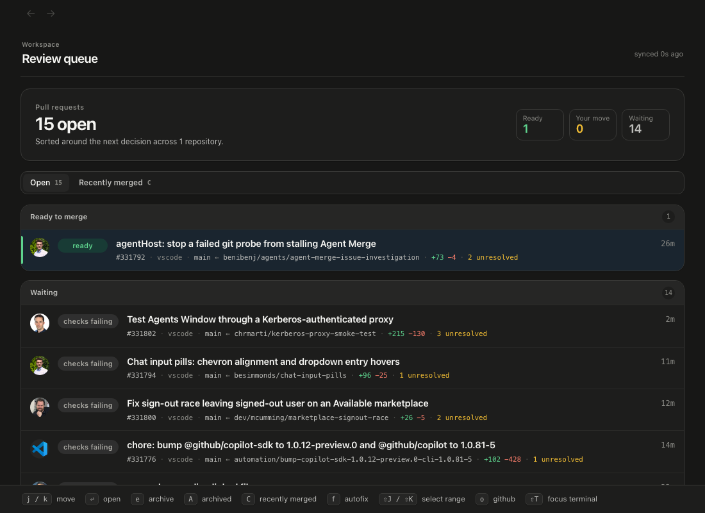
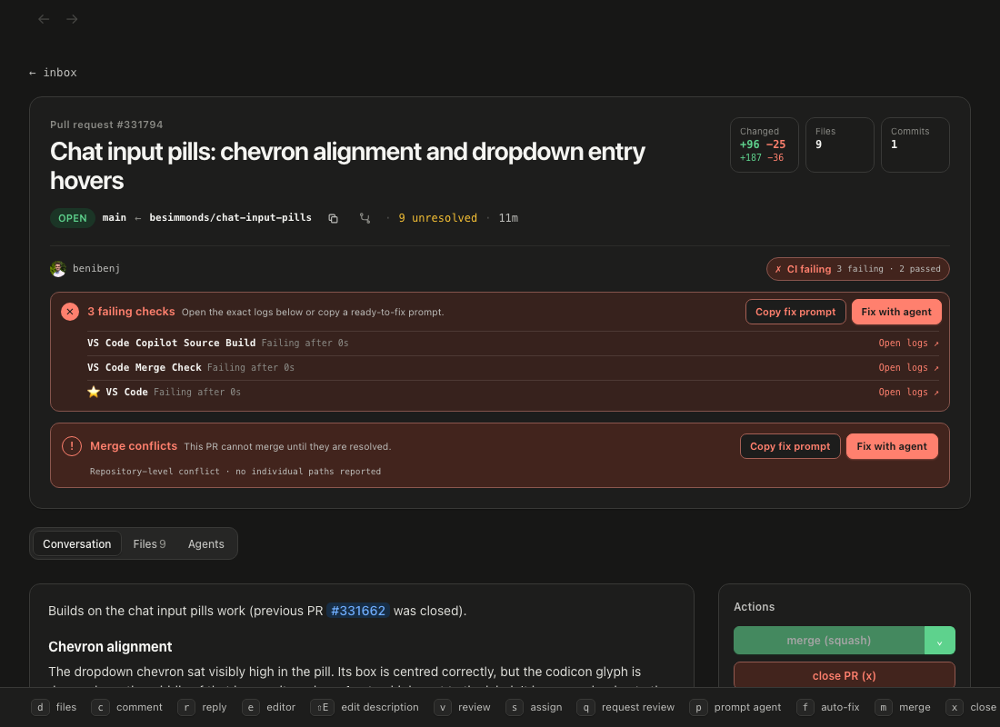
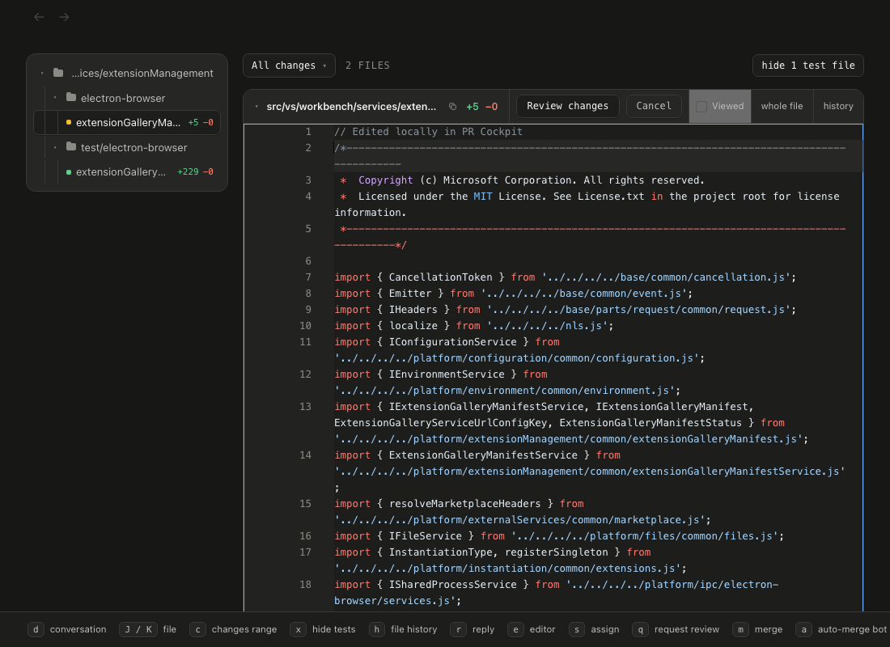
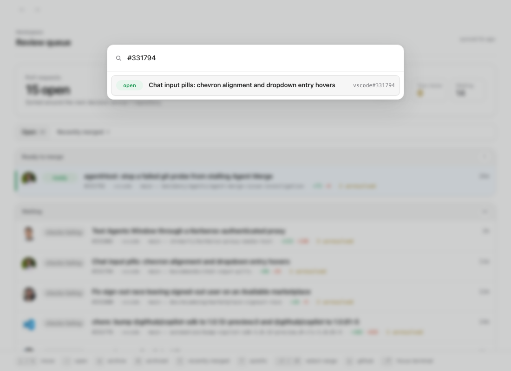

# PR Cockpit

**GitHub pull request reviews at local speed.**

A keyboard-first macOS app that keeps PRs, diffs, threads, checks, and images warm on your Mac. Actions feel immediate and sync back through your existing `gh` login.

[Website](https://theolundqvist.github.io/pr-cockpit/) · [Install](#install) · [Shortcuts](#shortcuts)



## Install

```sh
curl -fsSL https://raw.githubusercontent.com/theolundqvist/pr-cockpit/main/scripts/bootstrap | bash
```

The installer checks macOS prerequisites, asks before installing anything, and opens a four-step setup. Rerun the same command to upgrade. It replaces a legacy private PR Cockpit installation while preserving your local PR data and settings.

## One queue. Every decision.

Ready to merge, your move, and waiting. Stacked PRs stay together.



## Read, edit, ship.

Inspect diffs, hide tests, walk file history, edit source, and commit the patch back to the pull request.



## Jump anywhere.

Press <kbd>⌘⌥K</kbd> from any app to search recent open, merged, and closed PRs.



## Local by default.

The cache, diffs, queued actions, and warmed images stay on your Mac. GitHub remains the source of truth; webhooks refresh changed PRs and a poller repairs missed events.

## Start in four steps

1. Connect your existing GitHub CLI login.
2. Choose repositories.
3. Enable live updates.
4. Open the review queue.

Run **Settings → Run setup again** whenever you want to change repositories or live updates.

## Shortcuts

| Key | Action |
| --- | --- |
| <kbd>j</kbd> / <kbd>k</kbd> | Move |
| <kbd>enter</kbd> / <kbd>esc</kbd> | Open / back |
| <kbd>d</kbd> | Conversation / Files |
| <kbd>c</kbd> / <kbd>r</kbd> | Comment / reply |
| <kbd>e</kbd> | Edit the open file |
| <kbd>h</kbd> | File history |
| <kbd>m</kbd> | Merge |
| <kbd>?</kbd> | Full cheatsheet |

<details>
<summary><strong>CLI and coding agents</strong></summary>

The installer adds the open-source `pr-cockpit` CLI. It reads the same local cache as the app, so agents do not spend GitHub API quota rediscovering review state.

```sh
pr-cockpit owner/repo#123
pr-cockpit owner/repo#123 --diff
pr-cockpit owner/repo#123 --file path/to/file
pr-cockpit listen owner/repo#123
pr-cockpit resolve owner/repo#123 HANDLE
```

</details>

<details>
<summary><strong>Configuration</strong></summary>

Settings live in the app. Optional shell overrides live in `~/.config/pr-cockpit/config`.

| Variable | Purpose |
| --- | --- |
| `COCKPIT_REPOS` | Comma-separated `owner/repo` list |
| `COCKPIT_PORT` | Local HTTP port; defaults to `4820` |
| `COCKPIT_DEFAULT_REPO` | Repository assumed when a PR number is passed alone |
| `COCKPIT_REPO_ROOTS` | Paths containing local checkouts |
| `COCKPIT_RELAY_URL` | Optional self-hosted webhook relay |

</details>
