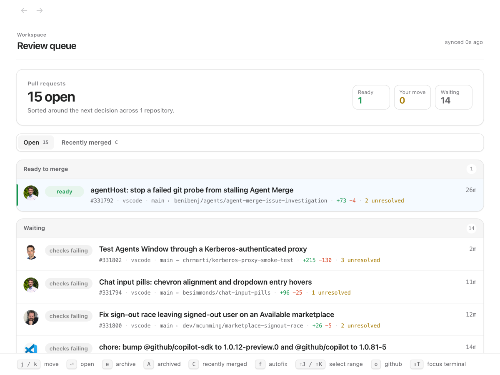
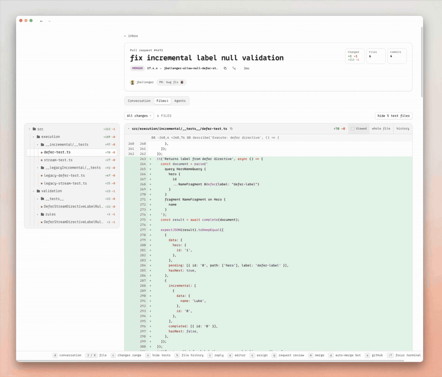

# PR Cockpit

**A review queue, not another row of GitHub tabs.**

PR Cockpit is a desktop app for GitHub pull requests on **macOS and Linux**. See what needs your attention, read the diff, work through review threads, and merge without piecing the PR together across tabs. A local cache keeps the review close; GitHub stays the source of truth.

[Install](#install) · [See the workflow](#from-finding-the-pr-to-finishing-the-review) · [CLI for humans and agents](#the-same-pr-context-in-your-terminal) · [Website](https://prcockpit.com/)



The queue separates **ready to merge**, **your move**, and **waiting**. Checks, conflicts, unresolved threads, and review state give you the context to decide what to open next. Stacked pull requests stay together.

## Install

Run this in your terminal as your normal user, **not with `sudo`**:

```sh
curl -fsSL https://raw.githubusercontent.com/theolundqvist/pr-cockpit/main/scripts/bootstrap | bash
```

[Read the installer first](scripts/bootstrap). It checks prerequisites, installs the desktop app and `pr-cockpit` CLI, and opens setup. On macOS it offers to install missing tools where supported; on Linux it checks system prerequisites and installs missing Bun and GitHub CLI tools into the managed installation.

**Supported platforms:** macOS and Linux. Linux requires systemd and the desktop libraries listed by the installer; x64 and arm64 are supported. X11 is supported directly; Wayland uses XWayland, and global shortcuts depend on compositor policy. Windows is not supported.

### Try it on a PR you already know

- **Connect GitHub in the app.** Cockpit reuses your GitHub CLI (`gh`) login. If you need to sign in or grant additional access, setup opens the GitHub authorization flow in your browser.
- **Choose a repository you work in.** Start with an open PR you've authored or participated in. **Open** follows PRs involving you; **All PRs** shows every open PR in your selected repositories. You can enter `owner/repo` if it is not in the suggested list.
- **Enable live updates, or continue with polling.** Live updates use a GitHub App installation with access to your selected repositories. An organization may require an owner's approval; that need not block your first review.
- **Open the queue and pick that PR.** Read the conversation, press <kbd>d</kbd> to switch to Files, and inspect a change. Press <kbd>?</kbd> whenever you want the shortcut guide.

The first sync fetches PRs involving you. **All PRs** loads on demand without expanding background polling. Press <kbd>Tab</kbd> to cycle Open, All PRs, and Recently merged. Repository and live-update configuration live in Settings.

## From finding the PR to finishing the review

### Bring up a PR without leaving your editor

Press <kbd>⌥⌘K</kbd> on macOS or <kbd>Super+Alt+K</kbd> on Linux X11 to search from another app. Open the result in Cockpit, with the cached PR ready to read.


### Read the change, then follow the details

Diffs, threads, checks, and file history live in the same review workspace. Press <kbd>x</kbd> to fold test files when you want to see the implementation first; press it again to bring the tests back.



When the review needs a change, stay in context: <kbd>e</kbd> edits the open file and commits the patch to the PR; <kbd>p</kbd> opens the PR in your configured coding agent with review context. You can also revert a focused hunk or press <kbd>h</kbd> to inspect file history.

<details>
<summary><strong>Everyday shortcuts</strong></summary>

| Key | Action |
| --- | --- |
| <kbd>j</kbd> / <kbd>k</kbd> | Move |
| <kbd>enter</kbd> / <kbd>esc</kbd> | Open / back |
| <kbd>d</kbd> | Conversation / Files |
| <kbd>c</kbd> / <kbd>r</kbd> | Comment / reply |
| <kbd>p</kbd> | Open in the configured agent |
| <kbd>e</kbd> | Edit the open file |
| <kbd>x</kbd> | Hide / show test files |
| <kbd>h</kbd> | File history |
| <kbd>m</kbd> | Merge |
| <kbd>?</kbd> | Full shortcut guide |

</details>

## The same PR context in your terminal

The included `pr-cockpit` CLI reads the same local cache as the app. Use it yourself, or give your coding agent a way to inspect a PR without repeatedly fetching it from GitHub. Set up the app first; the CLI needs the local Cockpit server.

Replace `owner/repo#123` with your pull request:

```sh
pr-cockpit owner/repo#123                   # state, checks, and review threads
pr-cockpit owner/repo#123 --diff            # cached unified diff
pr-cockpit owner/repo#123 --file src/app.ts # file contents at the PR head
pr-cockpit owner/repo#123 --jobs            # queued, running, and completed jobs
pr-cockpit owner/repo#123 --logs            # cached failed and cancelled job logs
```

**Waiting on CI or a review? Listen instead of polling.**

```sh
pr-cockpit listen owner/repo#123
```

`listen` waits for substantive cached state changes—a push, check result, review, or comment—then prints what changed and exits. `--ci-only` and `--comments-only` narrow the wake signal.

The CLI also supports comments, reviews, thread resolution, edits, and merges through Cockpit's mutation queue. Run **`pr-cockpit --help`** for commands and options, including `--body-file` for exact multiline text and `--json` for machine-readable status. The installer separately asks before adding Cockpit instructions to supported coding assistants.

## Local reads. GitHub authority.

Cockpit is a client for your existing GitHub workflow, not a second place to maintain pull requests.

- **On your machine:** a Bun server maintains a SQLite cache of PR state and serves the desktop UI and CLI. Diffs, threads, checks, and images are cached locally.
- **Back to GitHub:** comments, reviews, file edits, thread resolution, and merges use your GitHub CLI authentication. GitHub remains authoritative.
- **Keeping it current:** the hosted relay is enabled by default. It receives GitHub webhooks and delivers compact change markers and Actions run/job state, including runner assignment—not full PR contents or job logs—to Cockpit. Targeted refreshes update the cache; a direct GitHub poller repairs missed events.
- **Your relay, if you prefer:** you can configure a different relay URL. See [Self-hosting](docs/self-host-relay.md) for deployment and connection instructions.

Local caching does **not** mean the app makes no external connections. Besides GitHub and the relay, the backend has [Sentry error reporting enabled by default](server/sentry.ts).

<details>
<summary><strong>Updates, diagnostics, and configuration</strong></summary>

```sh
pr-cockpit update  # update and reconcile the installed app
pr-cockpit status  # identify the process supervising the local server
```

The installer manages the background server and desktop integration. On Linux, `$HOME/.pr-cockpit/scripts/uninstall` removes a default installation; adding `--purge` also removes its local data.

Use Settings for day-to-day configuration. Optional shell overrides live in `~/.config/pr-cockpit/config` (Linux respects `XDG_CONFIG_HOME`).

| Variable | Purpose |
| --- | --- |
| `COCKPIT_REPOS` | Comma-separated `owner/repo` list |
| `COCKPIT_PORT` | Local HTTP port; defaults to `4820` |
| `COCKPIT_DEFAULT_REPO` | Repository assumed when a PR number is passed alone |
| `COCKPIT_REPO_ROOTS` | Paths containing local checkouts |
| `COCKPIT_RELAY_URL` | Custom webhook relay URL |
| `COCKPIT_TAILSCALE_SERVE` | Set to `1` to publish Cockpit privately through Tailscale Serve |
| `COCKPIT_TAILSCALE_HTTPS_PORT` | Tailscale HTTPS port; defaults to `443` |

</details>

## Contribute

Found friction in a real review? [Open an issue](https://github.com/theolundqvist/pr-cockpit/issues) with what you were trying to do and what got in the way. Keep reports and screenshots free of private repository data.

Fixes, functionality, themes, and UI polish are welcome. Read the [contributor and agent guide](AGENTS.md) for development setup and repository conventions. New functionality must default off; styling must be opt-in unless it is minor polish that preserves the default appearance. Pull requests must include before-and-after screenshots showing their effect in the app.

[MIT licensed](LICENSE).
