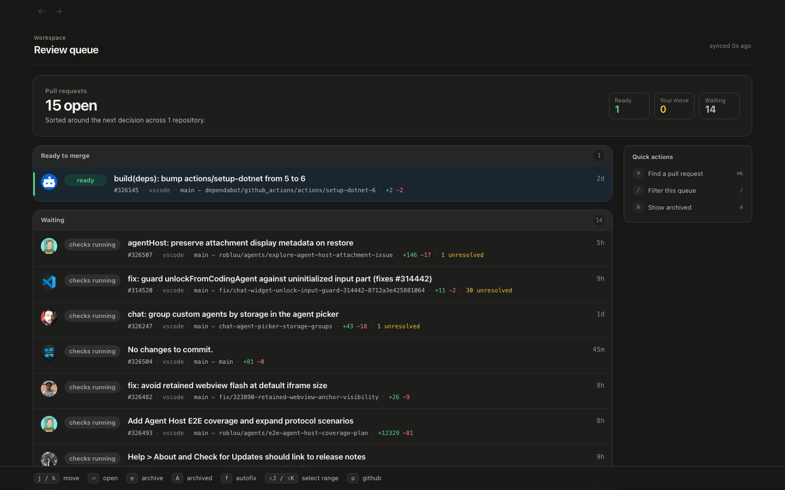
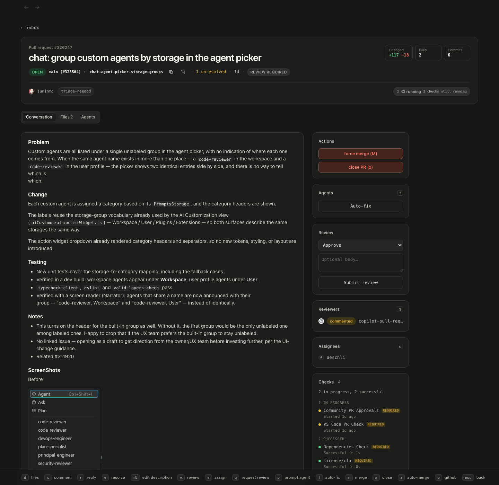
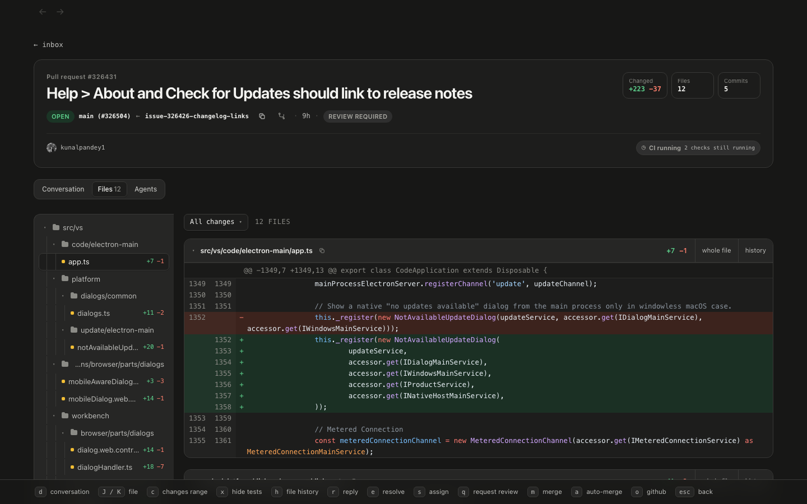
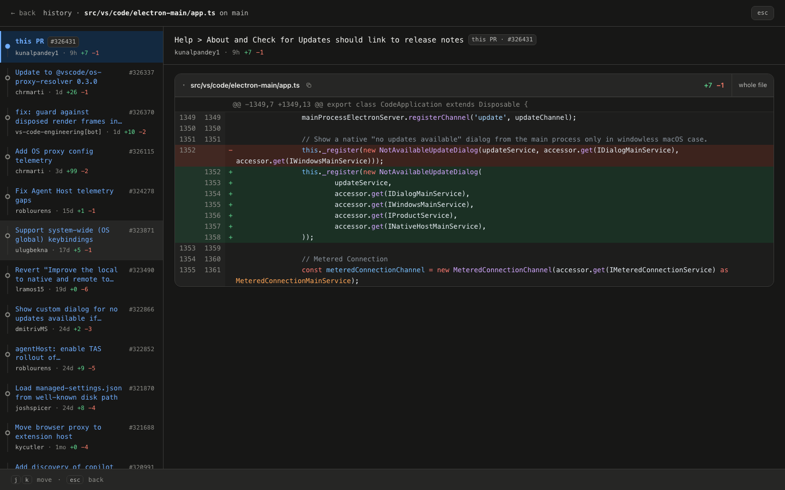
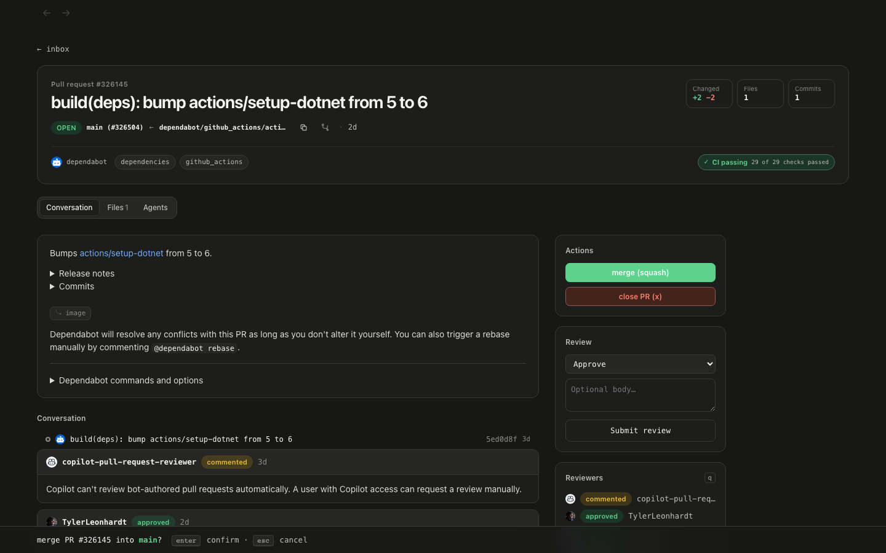
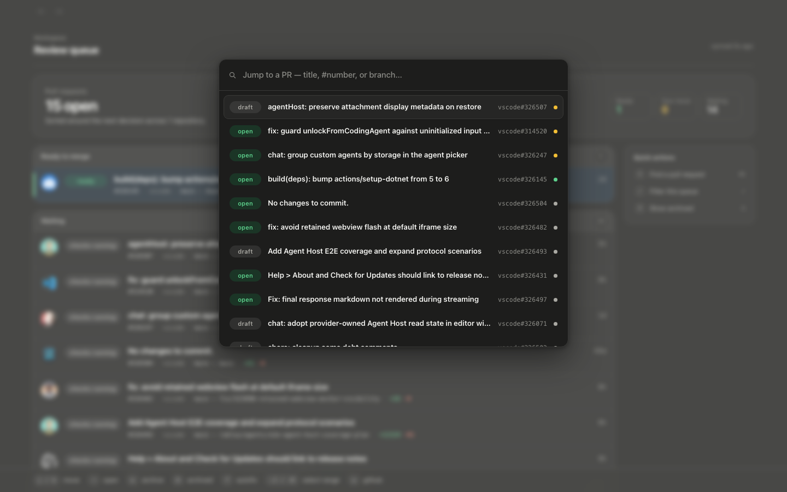

# PR Cockpit

GitHub pull request reviews at local speed. PR Cockpit is a keyboard-first macOS app that keeps the repositories you care about synced to a local cache, receives GitHub changes through webhooks, and makes every action feel instant. No refreshes. No loading screens.

It is deliberately focused on reviewing. Use GitHub for browsing repositories, issues, and everything else. Use PR Cockpit to live in your review queue.

## Install

PR Cockpit runs on macOS. It needs Git, [Bun](https://bun.sh), and [GitHub CLI](https://cli.github.com) logged in to your account. You do not have to arrange that yourself: the bootstrap script checks for each one, asks before it installs anything, and can install Bun and GitHub CLI and run `gh auth login` for you.

```sh
curl -fsSL https://raw.githubusercontent.com/theolundqvist/pr-cockpit/main/scripts/bootstrap | bash
```

That clones the repository to `~/.pr-cockpit` and runs the installer. Set `COCKPIT_HOME=/some/path` to clone elsewhere; the path is baked into the launch agents, so do not move the checkout afterwards. Running the same command again is also the upgrade path: it fast-forwards the checkout and reinstalls.

Prefer to read the script before running it? Clone over HTTPS and install manually.

```sh
git clone https://github.com/theolundqvist/pr-cockpit.git
cd pr-cockpit
scripts/install
```

`scripts/install` expects Bun and an authenticated `gh` to already be present and tells you what is missing otherwise. It installs dependencies, builds the UI, creates `~/Applications/PR Cockpit.app`, adds the `pr-cockpit` CLI to your PATH, registers `prcockpit://` links, sets up launch at login, and writes a starting configuration to `~/.config/pr-cockpit/config`.

The app starts hidden but remains available in the Dock and menu bar. Press `⌘⌃G` anywhere to show it, or `⌘⌥K` to open PR search globally. Both shortcuts are configurable. Closing the window keeps PR Cockpit running; **Quit PR Cockpit** exits it.



## Why it feels fast

- **Updates arrive live.** Once you install the relay's GitHub App on a repository, new comments, reviews, and CI changes appear within seconds, whether you use PR Cockpit alone or with a team.
- **Every PR is ready before you open it.** Details, diffs, threads, and images for your tracked repositories are prefetched into a local SQLite cache.
- **Actions happen immediately.** Comment, reply, resolve, review, merge, or close. The UI updates first, then a persisted queue sends the action to GitHub in the background with your existing `gh` login.
- **The keyboard runs the whole review.** Move through the inbox, inspect files, answer threads, submit a review, and merge without reaching for the mouse.

## Review without the GitHub wait

The inbox sorts open PRs around your next decision: ready to merge, your move, or waiting. Stacked PRs stay nested, and the branch checked out on your Mac is marked.



The PR view puts the description, commits, comments, review threads, checks, reviewers, labels, and actions in one place. Its merge gate mirrors GitHub's real state, so you see the same decision without the navigation delay.



The Files tab has a full file tree, inline threads, whole-file expansion, a changed-range filter, and a hide-test-files toggle. Press `h` on a file to walk its history on the base branch. Those diffs are prefetched too.



Destructive actions still ask for confirmation.



Press `⌘K` in the app to search a local index of recent open, merged, and closed PRs across your tracked repositories. If the local index comes up short, PR Cockpit falls back to live GitHub search.



## Live updates

Live updates are the intended way to use PR Cockpit, and they are one click. A shared relay is configured out of the box, so all you do is install the public `pr-cockpit-relay` GitHub App on the repositories you track. GitHub sends events to the relay, your cockpit picks them up, and comments, reviews, and CI changes land within seconds. No Cloudflare account, no server of your own, nothing to keep running.

The shared relay is a personal best-effort service with no uptime guarantee. It is fine to depend on for a review queue and wrong to depend on for anything critical. If you would rather own it, the worker source is in [`relay/`](relay/): deploy it to your own Cloudflare account with `wrangler deploy` and point your cockpit at it with `COCKPIT_RELAY_URL` or the relay URL field in Settings. Settings then has a one-time **Set up GitHub App** step that creates a GitHub App under your organization pointed at your relay and hands you the `wrangler secret put WEBHOOK_SECRET` command to finish it. Clearing the relay URL turns live updates off.

Underneath live push, a poller runs every 3 minutes by default and is configurable in Settings. It fills the cache on startup, catches anything a webhook missed, and reconciles local state with GitHub. The poller is the correctness backstop; the relay provides the live, no-refresh experience.

There is no hosted copy of your review data. The PR cache, diffs, and queued actions stay on your Mac, and PR Cockpit uses your existing `gh` authentication when it talks to GitHub. The relay stores event markers only, a repository name, a PR number, and an event type, and it hands you markers for a repository only after proving your own GitHub token can already read it.


## First run

The app walks you through setup the first time it opens, in four steps.

1. **Connect.** It checks your GitHub CLI login and shows the exact command to run if `gh` is missing or not authenticated, with a re-check button.
2. **Repos.** Pick from your recent repositories, filter the list by name, or type an `owner/name` for anything that is not there.
3. **Live updates.** One button installs the `pr-cockpit-relay` GitHub App on the repositories you chose. The app keeps checking until they show as covered, then confirms it. Skipping leaves you on the poller, which checks every few minutes.
4. **Done.** It saves your settings, starts the first sync, and shows its progress instead of an empty inbox.

You can change any of it later in Settings with `⌘,`, and **Run setup again** re-enters the same flow.

## Configuration

Settings covers everything day to day. For values you would rather keep in a file, `~/.config/pr-cockpit/config` holds plain shell variables. Repository and path variables seed the matching setting the first time PR Cockpit starts, and Settings wins from then on.

| Variable | Meaning |
| --- | --- |
| `COCKPIT_REPOS` | Comma-separated `owner/repo` list to track |
| `COCKPIT_DEFAULT_REPO` | Repository assumed when you pass a bare PR number to the launcher or CLI |
| `COCKPIT_REPO_ROOTS` | Comma-separated paths where your local checkouts live, used when switching to a checkout with `t` |
| `COCKPIT_PORT` | HTTP port, `4820` by default |
| `COCKPIT_RELAY_URL` | Webhook relay to listen to; empty turns live updates off |
| `COCKPIT_REVIEW_BOTS` | Review bots whose scores should be parsed, see below |

### Review bot scores

PR Cockpit reads a numeric score out of a review bot's comment when it recognizes the bot's format. `greptile-apps` and `cursor` are built in. To teach it another bot, set `COCKPIT_REVIEW_BOTS` to a JSON array of `{ "login": ..., "patterns": [...] }`, where each pattern is a case-insensitive regular expression whose first capture group is the score. Patterns are tried in order and the first one that parses wins.

```sh
COCKPIT_REVIEW_BOTS='[{"login":"my-reviewer","patterns":["Confidence:\\s*([\\d.]+)/5"]}]'
```

Entries merge over the built-ins by login, so you can also replace a built-in bot's patterns. An empty `patterns` array means the bot is known but never carries a score, which keeps PR Cockpit from guessing one. A malformed entry or a bad regular expression is ignored with a warning rather than breaking scoring.

A bot entry can also carry a `staleMarker` string. Some bots claim their thread resolves itself on the next review, which is not always true. When an outdated thread's comment contains that string, the CLI flags it so an agent resolves it by hand instead of trusting the promise.

## Use PR Cockpit with coding agents

The installer puts the `pr-cockpit` CLI on your PATH, in Bun's bin directory when that is writable and `~/.local/bin` otherwise. Treat it as the only allowed source for pull request reads: it serves the local cache and mirror instead of spending GitHub API quota in every agent session.
Run `pr-cockpit` inside a repository to list its cached PRs. Open review threads include stable short handles; `pr-cockpit resolve REF HANDLE` resolves one without exposing GitHub node IDs. `pr-cockpit listen [REF]` waits for substantive cached state to change and then prints the refreshed result.

Add this policy to the user's global `AGENTS.md` (for example, `~/.config/AGENTS.md`):

```md
## GitHub access

Route every GitHub operation through an approved path:

- Pull request reads MUST use PR Cockpit. Run `pr-cockpit owner/repo#N` for the cached PR body, state, review, CI, and open threads; use `pr-cockpit resolve owner/repo#N HANDLE` to resolve a settled thread; add `--json` only for automation, `--diff` for the complete cached diff, or `--file <path>` for a whole file at the PR head. PR cache misses refresh only through Cockpit, and quota failures still return the cached snapshot. Never call a PR ready from `stale` or `outdated` data.
- Issue reads MUST use the agent platform's cache-backed issue reader.
- Writes MUST use PR Cockpit's app or the repository's approved write workflow.

Direct GitHub read APIs are forbidden. NEVER use `gh api`, `gh pr view`, `gh issue view`, or `raw.githubusercontent` for PR or issue reads.
```

PR Cockpit's CLI currently serves PR reads only. The issue and write routes above make the policy exhaustive without claiming unsupported CLI features.

## Everyday keys

| Key | Action |
| --- | --- |
| `j` / `k` | Move through the current list |
| `enter` / `esc` | Open / go back |
| `d` | Switch between conversation and files |
| `c` / `r` | Comment / reply |
| `e` | Open the PR checkout in your editor (or archive, from the inbox) |
| `v` | Submit a review |
| `m` / `⇧M` | Merge / force merge |
| `h` | Open file history |
| `o` | Open the PR on GitHub |
| `t` | Switch your local checkout to the PR branch |
| `⌘K` / `⌘⌥K` | Search any PR in the app / globally |
| `⌘P` | Browse files at the PR head |
| `⌘⇧F` | Search code at the PR head |
| `?` | Open the full in-app cheatsheet |

Pressing `t` switches an existing local checkout in place. It never opens a terminal or creates a worktree, and Git still blocks a switch that would overwrite local work. Configure checkout locations with `COCKPIT_REPO_ROOTS="/path/to/checkout"` or in Settings.

## Local agents

Each PR also has an Agents tab for local coding-agent workflows such as auto-fixing a blocked PR, waiting to merge until CI and review threads are clear, re-scoring a Greptile review, or running a one-off prompt. They drive Claude Code or Oh My Pi, whichever you select in Settings. Agents are off by default. You choose which ones to arm, and their transcripts stream live in the app.

## Update

Run the bootstrap one-liner again, or from a manual clone:

```sh
scripts/update
```

This pulls the latest version, rebuilds the UI, and restarts the server and app.

## How the instant part works

PR Cockpit moves the network off the path between intent and feedback. A Bun server keeps PR data and images warm in SQLite and on disk, so the Svelte UI reads locally instead of waiting on GitHub. Webhooks trigger targeted refreshes as changes happen, while the configurable poller handles startup and reconciliation.

Writes take the same approach in reverse. PR Cockpit immediately echoes an action into the UI, saves it to a persisted queue, and sends it to GitHub in the background through `gh`. The next webhook or poll reconciles the result with GitHub's source of truth.

The Electron shell is only the macOS window and global hotkeys. The same app is available locally at `http://127.0.0.1:4820`, and `prcockpit://pr/owner/repo/N` links open a PR directly.
